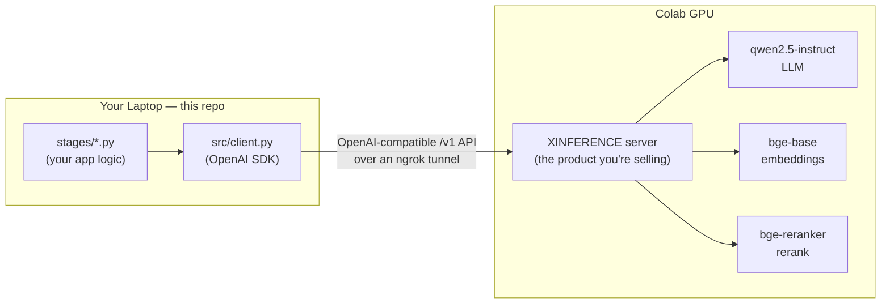
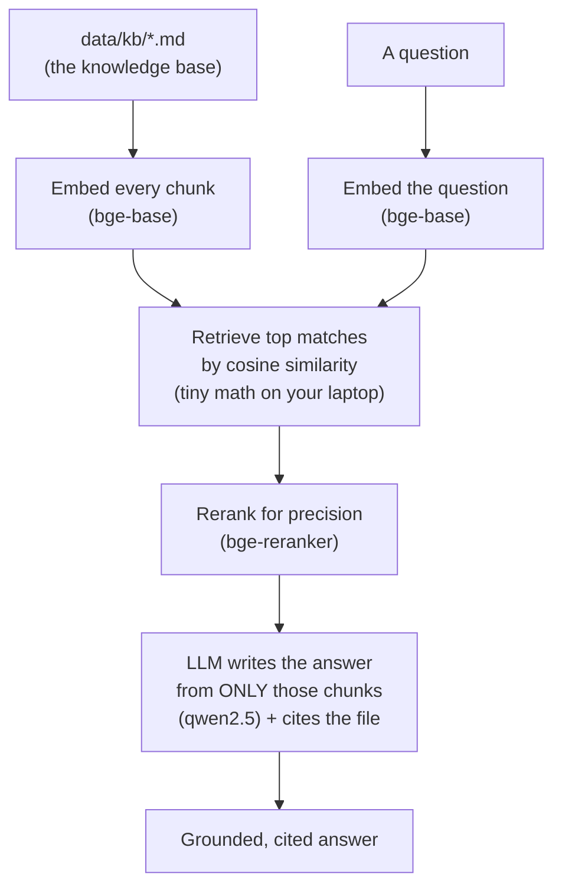
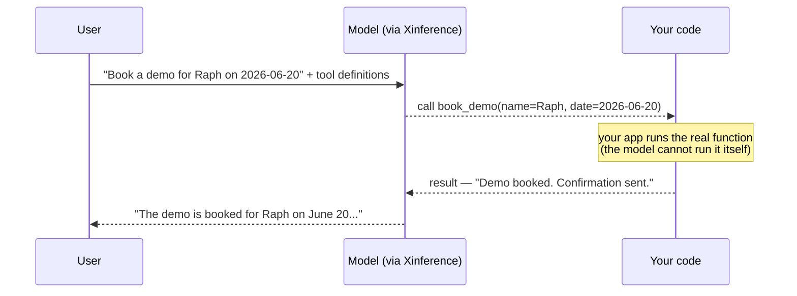

# How this build works — in pictures

Three diagrams, in the order that makes the build click. Open this file in VS Code's
markdown **preview** (`Cmd+Shift+V`) — the diagrams render live. They also render on
GitHub.

---

## 1. The core idea: two machines, one API

The single most important thing to understand. Your laptop **never runs a model**. It
sends API requests to **Xinference**, which runs the models on a cloud GPU and sends
answers back.

**What it teaches:** Xinference *is* the server. It takes raw model files and turns them
into a callable API. One server is hosting three different model types at once — that
"multi-model serving" is a headline Xinference selling point. Your code is just a thin
client pointed at it.

---

## 2. RAG (Stage 01): how the three models cooperate

This is why Stage 01 answered accurately and *cited a source*, while Stage 00's bare LLM
just guessed. The embedder + reranker find the right documents; the LLM answers from
only those.

**What it teaches:** "RAG" = Retrieval-Augmented Generation. Instead of trusting the
LLM's memory, you *retrieve* relevant text first and make the LLM answer from it. All
three models are needed — and all three are served by the one Xinference instance.

---

## 3. Tool calling (Stage 02): the agent loop

How the assistant *does things* instead of just talking. The model decides which
function to call; **your code** runs it; the result goes back for a final answer.

**What it teaches:** the split between **deciding** (the model/agent plans) and
**acting** (your application executes). Xinference emits the structured call; you own
the execution and the guardrails. And when a question needs no tool ("capital of
France?"), the model just answers — it chooses.

---

## The arc in one line

`00 serve` → prove the API · `01 rag` → ground it in docs · `02 tools` → let it act ·
`03 scale` → test it under load. Each stage spotlights one Xinference capability.
